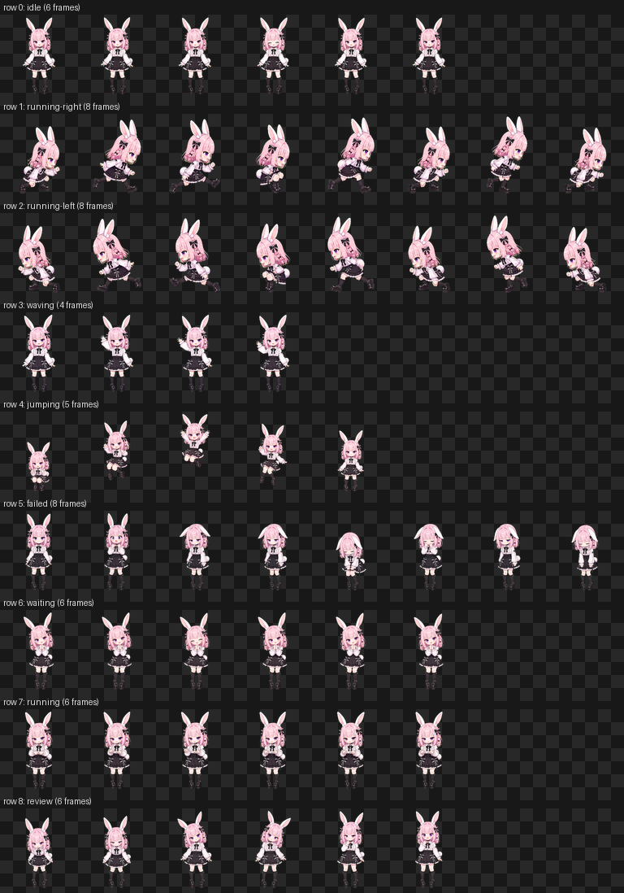

# 🐾 酒館桌寵 TavernPet — SillyTavern Extension

> 在你的酒館裡養一隻會散步、會看氣氛做反應的日系動畫桌寵！

一個輕量的 SillyTavern 擴充：畫面上會出現一隻可拖曳的動畫小寵物「桃兔」（粉髮、紫瞳與白兔耳尾的地雷系 Q 版少女），
牠會在你和 AI 聊天時用動作即時反應——AI 思考時牠埋頭工作、回覆送達時牠揮手慶祝、
生成被中斷時牠難過掉淚。全程無文字、不打擾。



## ✨ 功能

- 🎞️ **9 種狀態動畫** — 待機、左右奔跑、揮手、跳躍、失落、期待、工作中、端詳，逐格像素動畫
- 💬 **酒館事件連動（純動作）** — 送出訊息→興奮跳躍；AI 生成中→埋頭苦幹；回覆完成→揮手；中斷→掉淚
- 🖱️ **可拖曳** — 拖著走時會朝移動方向奔跑，放下後彈跳落地；滑鼠、觸控都支援
- 🐾 **自由活動** — 沒事的時候會自己散步、東張西望、發呆
- 🤗 **摸頭互動** — 點牠會有反應，連點三下會開心地連續揮手
- 💾 **位置記憶** — 重新載入後還在原位，旋轉/縮放/軟鍵盤彈出會自動夾回畫面內
- 🐰 **寵物選單** — 設定面板可切換寵物；未來新增的寵物會自動出現在選單裡
- 🔁 **一鍵更新** — 設定面板按「檢查更新」即可更新到最新版，不用刪除重裝
- 🎨 **可換裝** — 想要自己的角色？照 [AI_ART_GUIDE.md](AI_ART_GUIDE.md) 請任何生圖 AI 畫，一行指令組裝
- 🪶 **零依賴** — 純原生 JS/CSS，`prefers-reduced-motion` 時自動改為靜態顯示

## 📦 安裝

在 SillyTavern 的「擴充」→「安裝擴充」中貼上此 repo 的 URL，
或手動把整個資料夾放進 ST 的使用者擴充目錄（資料夾名稱需保持 `SillyTavern-TavernPet`）。

之後有新版本時，到設定面板按「⬆️ 檢查更新」即可，不用重新安裝。

## ⚙️ 設定

安裝後在 **擴充設定** 中找到「🐾 酒館桌寵 TavernPet」面板：

| 設定 | 說明 |
|------|------|
| 顯示桌寵 | 開啟/關閉 |
| 自由活動 | 允許牠自己散步、發呆 |
| 酒館事件反應 | 生成中/回覆/中斷等狀態連動 |
| 寵物 | 切換要登場的寵物（清單來自 `assets/pets/pets.json`） |
| 大小 | 48px ~ 192px |
| 透明度 | 10% ~ 100% |
| 自訂圖集 | 貼上自訂精靈圖 URL；填了會蓋過寵物選擇 |
| 重置位置 | 移回右下角 |
| 檢查更新 | 一鍵更新到最新版（透過 ST 內建擴充 API 執行 git pull） |

## 🎨 用 AI 生成你自己的寵物

**完整流程見 [AI_ART_GUIDE.md](AI_ART_GUIDE.md)**——裡面有可以直接複製給
GPT-4o / Gemini / Midjourney 等任何生圖 AI 的逐狀態 prompt。簡述：

1. 請 AI 生成 1 張定裝照 + 8 張橫向動畫條（純色背景），存進 `rows/`
2. 執行組裝（自動去背、切格、統一縮放、組成標準圖集）：

   ```bash
   pip install pillow
   python tools/build_atlas_from_rows.py rows --id mypet --name 寵物名
   ```

3. 看 `assets/pets/mypet/qa/` 裡的 contact-sheet 與 GIF 確認效果
4. 把 `mypet` 加進 `assets/pets/pets.json` 的清單，重新整理酒館後就能在設定面板選到牠

### 新增寵物到選單

寵物選單的內容來自 `assets/pets/pets.json`。新增一隻寵物只要兩步，不用改程式：

1. 在 `assets/pets/` 建立 `<id>/` 資料夾，放入 `pet.json`（名稱與介紹）和 `spritesheet.png`（圖集）
2. 把 `<id>` 加進 `assets/pets/pets.json` 的 `pets` 陣列

精靈圖規格與 openai/skills 的 [hatch-pet](https://github.com/openai/skills/tree/main/skills/.curated/hatch-pet)
（Codex pet）完全相容——hatch-pet 產出的 `spritesheet.webp/png` 可直接使用。

## 🛠️ 開發

直接用瀏覽器開 `dev/preview.html` 可在酒館外預覽：內含各狀態按鈕、模擬生成中、散步。
主控台或 STscript 也可呼叫 `window.TavernPet.play('jumping')`、`.walk()`、`.pets()`。

## 🙏 致謝

- 拖曳/定位/夾限邏輯參考 [SillyTavern-GreenGuaiGuai](https://github.com/Minijinai75/SillyTavern-GreenGuaiGuai)（MIT）
- 精靈圖規格與動畫時長來自 [openai/skills hatch-pet](https://github.com/openai/skills/tree/main/skills/.curated/hatch-pet)
